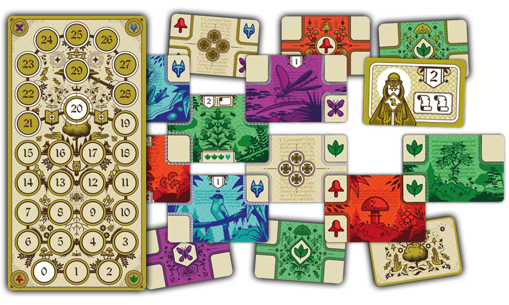
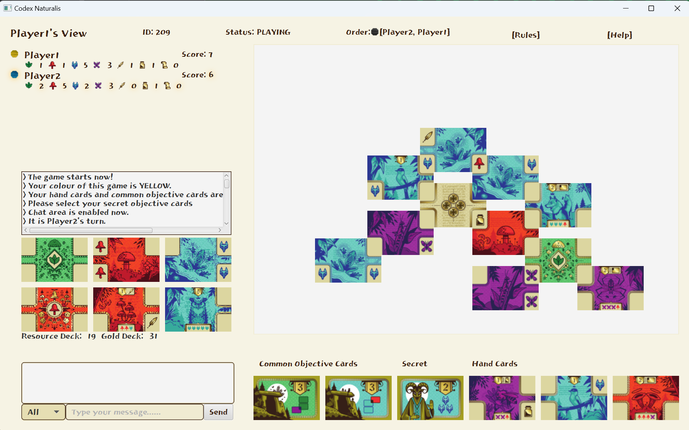

# Codex Naturalis 🌿🍄🦋🐺

## About

Codex Naturalis is the final project of the "Software Engineering" course held at Politecnico di Milano (A.Y. 2023/2024).

The group members are:

- Matteo Bergagna
- Antony Brun
- Lorenzo Chiroli
- Jie Chen

## Game Screenshot

    

## Project Status

| Satisfied Requirements                                                                              | Maximum Grade | Status |
|-----------------------------------------------------------------------------------------------------|---------------|--------|
| Simplified Rules + TUI + RMI or Socket                                                              | 18            | ☑️     |
| Complete Rules + TUI + RMI or Socket                                                                | 20            | ☑️     |
| Complete Rules + TUI + RMI or Socket + 1 FA (Chat)                                                  | 22            | ☑️     |
| Complete Rules + TUI + GUI + RMI or Socket + 1 FA (Chat)                                            | 24            | ☑️     |
| Complete Rules + TUI + GUI + RMI + Socket + 1 FA (Chat)                                             | 27            | ☑️     |
| Complete Rules + TUI + GUI + RMI + Socket + 2 FA (Chat & Multiple match)                            | 30            | ☑️     |
| Complete Rules + TUI + GUI + RMI + Socket + 3 FA (Chat & Multiple match & Disconnection resilience) | 30L           | ⚠️     |

### Currently Known Issues

- 🟨 The branch with the correct version of the network stack is not yet merged. Therefore, the network is not informing the View if the initial connection was successful or not.
- 🟥 The branch with the correct version of the network stack is not yet merged. Therefore, the network is not activating the PingTask that allows (in both Client & Server) the disconnection discovery in RMI.

## Code Coverage

The average code coverage, between Model and Controller, is 96% for methods and 85% for lines, all (known) edge cases are covered.
The coverage is calculated using the IntelliJ IDEA built-in tool.
